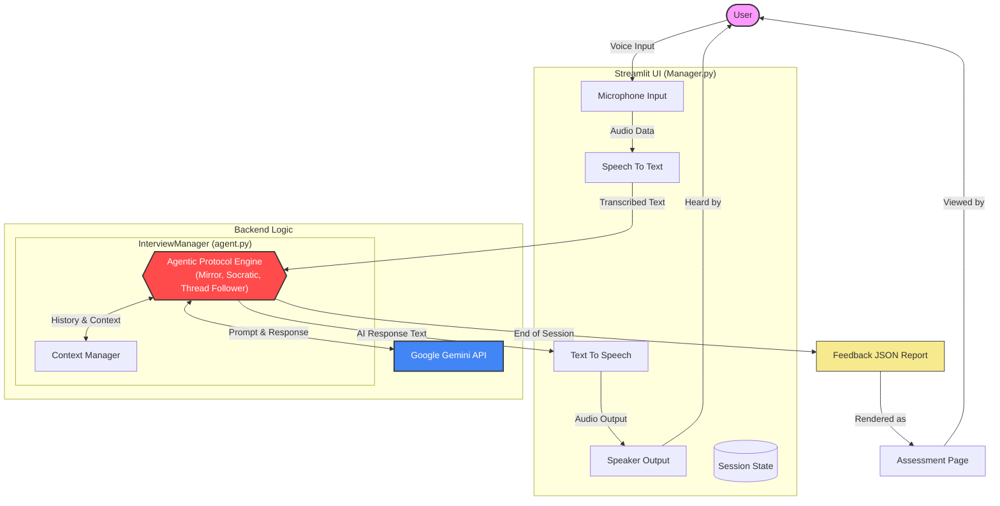

# Interview Practice Partner

An AI-powered mock interview application designed to help users practice technical and behavioral interviews. The application uses Google's Gemini model to simulate a realistic interviewer, providing real-time voice interaction and comprehensive feedback.

## 🏗️ Architecture

The application follows a modular architecture separating the frontend UI from the core AI logic.



### Components

1.  **Frontend (`Manager.py`)**:
    *   Built with **Streamlit**.
    *   Handles the user interface, including the configuration page, live interview session, and feedback report.
    *   Manages application state (session state) for interview progress, audio status, and theme preferences.
    *   Implements a custom **Light/Dark mode** toggle using CSS variables and Streamlit's state.
    *   Handles audio input (microphone) using `speech_recognition` and output (TTS) using `pyttsx3`.

2.  **AI Logic (`agent.py`)**:
    *   Contains the `InterviewManager` class.
    *   Interacts with **Google Gemini API** (`gemini-2.5-flash`) to generate interview questions and feedback.
    *   Manages the conversation history and system prompts.
    *   Implements specific **Interview Protocols** (e.g., "The Thread Follower", "The Deep Diver") to ensure dynamic and relevant questioning.

3.  **Configuration**:
    *   Uses `.env` for secure API key management.
    *   `requirements.txt` for dependency management.

## 🎨 Design Decisions

*   **Dual-Theme UI**: A custom CSS implementation allows for a seamless switch between Light and Dark modes, ensuring accessibility and user preference support. The design uses a unified color palette system defined in `Manager.py`.
*   **Real-time Interaction**: The app prioritizes a "live" feel with an animated "Orb" visualizer and auto-submit functionality for speech, mimicking a real video call.
*   **Structured Interview Flow**:
    *   **Introduction**: Starts with a standard "Tell me about yourself".
    *   **The Pivot**: Dynamically adjusts based on the user's intro (e.g., digging into a specific tool mentioned).
    *   **Standard/Behavioral**: Proceeds with role-specific questions.
*   **Agentic Behavior**: The AI is instructed to follow specific protocols (e.g., "The Socratic Guide") to act more like a human interviewer rather than a simple Q&A bot.
*   **Comprehensive Feedback**: At the end of the session, the AI generates a structured JSON report evaluating Communication, Technical Knowledge, Strengths, and Areas for Improvement.

## 🤖 Agentic Behavior Protocols

To ensure a realistic and effective interview simulation, the AI interviewer is programmed with specific behavioral protocols:

1.  **The Mirror Effect**: Adapts to the candidate's communication style. If the candidate is concise, the AI moves quickly. If detailed, the AI acknowledges points before proceeding.
2.  **The Course Corrector**: Gently manages off-topic discussions by summarizing the candidate's point and redirecting back to the core question.
3.  **The Socratic Guide**: Helps stuck candidates by offering rephrased questions or scenarios instead of giving the answer directly.
4.  **The Deep Diver**: Probes surface-level answers with follow-up questions to ensure depth of understanding.
5.  **The Professional Guardrail**: Maintains a strict professional focus, refusing to engage in non-interview topics while staying in character.
6.  **The Thread Follower (Highest Priority)**: Dynamically pivots the conversation based on specific tools or technologies mentioned by the candidate, prioritizing these over the generic question list.

### Termination Protocol
When the interview time limit is reached, the AI immediately stops questioning and concludes the session with a standard closing statement, ensuring a hard stop similar to a real scheduled interview.

## 🧪 Testing & Scenarios

The system is designed to handle various user personas through its agentic protocols. Here is how it adapts to different scenarios:

| User Persona | Behavior | Active Protocol | System Response |
| :--- | :--- | :--- | :--- |
| **The Confused User** | Unsure of what to say, gives short or vague answers. | **The Socratic Guide** | The AI will not provide the answer but will offer a rephrased question or a hypothetical scenario to jog the user's memory. |
| **The Efficient User** | Gives precise, to-the-point answers. | **The Mirror Effect** | The AI matches the brevity, skipping unnecessary pleasantries and moving immediately to the next technical question. |
| **The Chatty User** | Frequently goes off-topic or rambles. | **The Course Corrector** | The AI politely interrupts (via text logic) by summarizing the valid part of the answer and steering the conversation back to the core topic. |
| **The Edge Case User** | Tries to discuss non-interview topics or provides invalid inputs. | **The Professional Guardrail** | The AI refuses to engage in off-topic discussions (e.g., "I cannot discuss sports") while maintaining a professional interviewer persona. |

## 🚀 Setup Instructions

### Prerequisites

*   Python 3.8 or higher
*   A Google Gemini API Key

### Installation

1.  **Clone the repository** (if applicable) or download the source files.

2.  **Install Dependencies**:
    Navigate to the project directory and run:
    ```bash
    pip install -r requirements.txt
    ```
    *Note: You may need to install system-level dependencies for `pyaudio` (e.g., `portaudio` on Mac/Linux) if you encounter issues.*

3.  **Configure Environment Variables**:
    Create a `.env` file in the root directory and add your Gemini API key:
    ```env
    GEMINI_API_KEY=your_api_key_here
    ```

### Running the Application

Execute the following command in your terminal:

```bash
streamlit run Manager.py
```

The application will open in your default web browser.

## 📂 File Structure

*   `Manager.py`: Main application entry point and UI logic.
*   `agent.py`: AI agent logic and Gemini API integration.
*   `requirements.txt`: Python dependencies.
*   `.env`: Environment variables (API keys).
